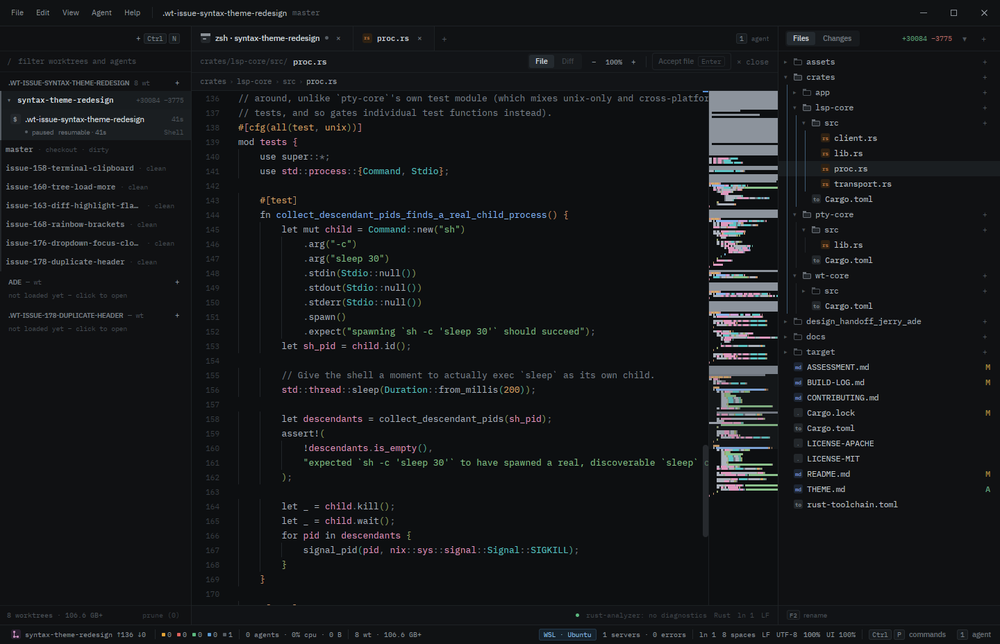

# ade ("Jerry")

A desktop app, built with [GPUI](https://www.gpui.rs/) (Zed's UI framework), for supervising
several AI coding agents (Claude Code, Codex, ...) at once, each running in its own git worktree.



The UI is three fixed zones:

- **Session rail** (left) — one row per session (one agent, one worktree, one task), with status
  derived from the underlying git/process state.
- **Work surface** (centre) — a tabbed pane per session with a spawned shell/agent CLI, rendered
  through `alacritty_terminal` grid emulation (cursor-addressed redraw, not a scrolling text dump).
- **Files / changes** (right) — a recursive file tree, a diff view against the session's detected
  base branch, and a code editor with full text editing (cursor/selection/IME support), backed by
  an LSP client (hover, go-to-definition, diagnostics, completions) across several languages, not
  just Rust. Merge conflicts resolve either structurally (per-hunk accept/reject) or by
  hand-editing conflict markers directly, in the same editor.

There's also a command palette (with a "History" group for undoing/redoing worktree-level actions
like committing or discarding a session's changes) and a settings surface (Keybindings, Language
Servers, Themes). More screenshots: [`docs/screenshots/`](docs/screenshots/).

## Status

A working prototype, not a released product — see [open issues](../../issues) for what's rough or
in progress. Built primarily through AI-agent-driven development sessions. GPUI's Linux backend
compiles both the `wayland` and `x11` features and picks between them at runtime from
`$WAYLAND_DISPLAY`/`$DISPLAY`; macOS has been run locally on Apple Silicon; Windows is currently
build-verified in CI only.

## Install

Prebuilt binaries for Linux, macOS, and Windows are attached to each
[release](../../releases/latest) (`jerry-linux.tar.gz`, `jerry-macos.tar.gz`,
`jerry-windows.zip`). Otherwise, build from source below.

## The stack

- **Rust**, pinned to the exact toolchain in [`rust-toolchain.toml`](rust-toolchain.toml).
- **[GPUI](https://www.gpui.rs/)** for the UI, a plain git dependency on
  [zed-industries/zed](https://github.com/zed-industries/zed) pinned to a specific commit (see
  [below](#gpui-version-pin)) — Cargo fetches it like any other dependency.
- **[`alacritty_terminal`](https://github.com/zed-industries/alacritty)** (the same fork/revision
  Zed's own `terminal` crate uses) for ANSI/grid terminal emulation, and **`portable-pty`** for
  spawning and managing the underlying PTY processes.
- **[`gix`](https://crates.io/crates/gix)** for read-only git operations and the **`git` CLI**
  (explicit argument vectors, never shell strings) for anything that mutates the repository.
- **[`lsp-types`](https://crates.io/crates/lsp-types)** plus a hand-written client in `lsp-core`
  that speaks to separately-installed language servers: `rust-analyzer`,
  `typescript-language-server`, Vue Language Tools, `pyright`, `gopls` — auto-detected per-server
  from each server's own `initialize` response. Settings → Language Servers links each server's
  install docs.
- **`tree-sitter`**, with grammars for Rust, TypeScript/TSX, and Python.

## Workspace layout

```
crates/
  wt-core/    git worktree management (gix reads, git-CLI mutations)
  pty-core/   PTY process spawning, I/O streaming, resize, process-tree teardown
  lsp-core/   LSP client (spawns and speaks LSP to rust-analyzer and other servers)
  app/        the GPUI application itself (binary crate)
assets/       bundled fonts (IBM Plex Sans/Mono, OFL) used by the app
design_handoff_jerry_ade/
              the design handoff this UI ("Jerry") was built from — reference only,
              not something to port markup from
docs/
  architecture/  target architecture (dependency rule, Command/Query core)
  adr/           architecture decision records
  themes.md, theme-palette-design.md
```

`crates/wt-core`, `crates/pty-core`, and `crates/lsp-core` have no `gpui` dependency and never
should — see [`docs/architecture/overview.md`](docs/architecture/overview.md) for the target
shape and [`CLAUDE.md`](CLAUDE.md) for the standards this workspace holds itself to.

Theming is documented separately: [`docs/themes.md`](docs/themes.md) for the file format and
authoring workflow, [`docs/theme-palette-design.md`](docs/theme-palette-design.md) for the syntax
palette's design rationale.

## Building and running it

### GPUI version pin

`gpui` and `gpui_platform` are plain git dependencies on
[zed-industries/zed](https://github.com/zed-industries/zed), pinned via `rev =` in the root
[`Cargo.toml`](Cargo.toml) to `7b030b500810b04cf5fb4aa5973be99a502d9f36` — the exact commit this
workspace was built and verified against. A different (e.g. newer) commit may or may not still
build against this workspace's code — GPUI's API isn't stable across arbitrary upstream revisions.

### System dependencies

**Linux** needs real dev packages for Wayland/X11/Vulkan/fontconfig:

```sh
sudo apt-get install -y \
  build-essential clang cmake pkg-config \
  libfontconfig-dev \
  libvulkan1 mesa-vulkan-drivers \
  libwayland-dev libxkbcommon-dev libxkbcommon-x11-dev libx11-xcb-dev \
  libasound2-dev
```

(Trimmed from upstream Zed's own [`script/linux`](https://github.com/zed-industries/zed/blob/main/script/linux)
— see `.github/workflows/ci.yml`'s Linux job comments for what was dropped and why.)

**macOS** needs Xcode Command Line Tools (`xcode-select -p` should print a path) and, if `cargo
build` fails with a Metal shader compilation error, `xcodebuild -downloadComponent
MetalToolchain`. No Homebrew packages — GPUI's macOS backend links Xcode's own system frameworks.

**Windows** needs no extra system packages beyond the Rust toolchain.

`.claude/commands/setup.md` (`/setup` in Claude Code) runs these checks for you.

### Build and test

```sh
cargo build --workspace
cargo test --workspace
cargo run -p app
```

These build the **debug** profile — fast to iterate on, but a debug-profile GPUI app is commonly
5–20x slower for this app's own per-frame work (layout/paint, `tree-sitter` parsing, terminal-grid
decode). For actually using the app, run the release profile instead:

```sh
cargo run --release -p app
```

`cargo clippy --workspace --all-targets -- -D warnings` and `cargo fmt --all -- --check` must also
pass — see [`CLAUDE.md`](CLAUDE.md) for the full set of standards,
[`CONTRIBUTING.md`](CONTRIBUTING.md) for the contribution process, and
[`docs/development-workflow.md`](docs/development-workflow.md) for how a change actually moves
issue → PR in this repo. If you use [Claude Code](https://claude.com/claude-code), this repo's
`.claude/` directory (skills, agents, commands) is set up for it already — installing the
[rtk](https://github.com/rtk-ai/rtk) CLI first and running `/setup` cuts token usage on command
output noticeably; it's optional, not a build dependency.

## Continuous integration

`.github/workflows/ci.yml` runs `cargo build`, `cargo test`, `cargo clippy -- -D warnings`, and
`cargo fmt --check` on Linux, plus a build-only job on macOS and Windows (with a narrow
per-process-sampling test on each, since neither compiles `#[cfg(test)]` modules under a plain
build).

## License

Licensed under either of [Apache License, Version 2.0](LICENSE-APACHE) or [MIT license](LICENSE-MIT)
at your option, matching the license of GPUI and this project's other key dependencies.

Unless you explicitly state otherwise, any contribution intentionally submitted for inclusion in
this project by you shall be dual licensed as above, without any additional terms or conditions.
