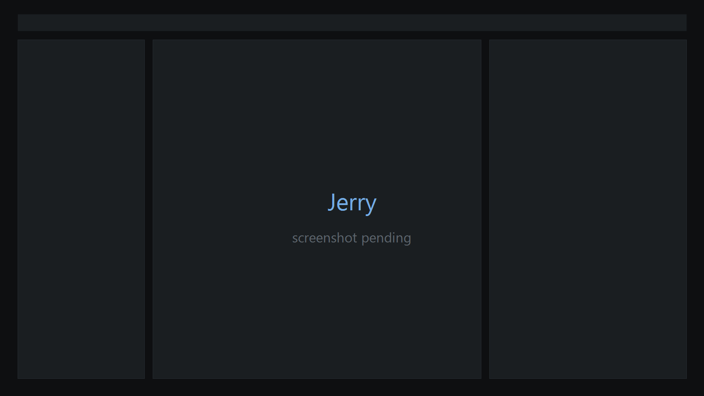
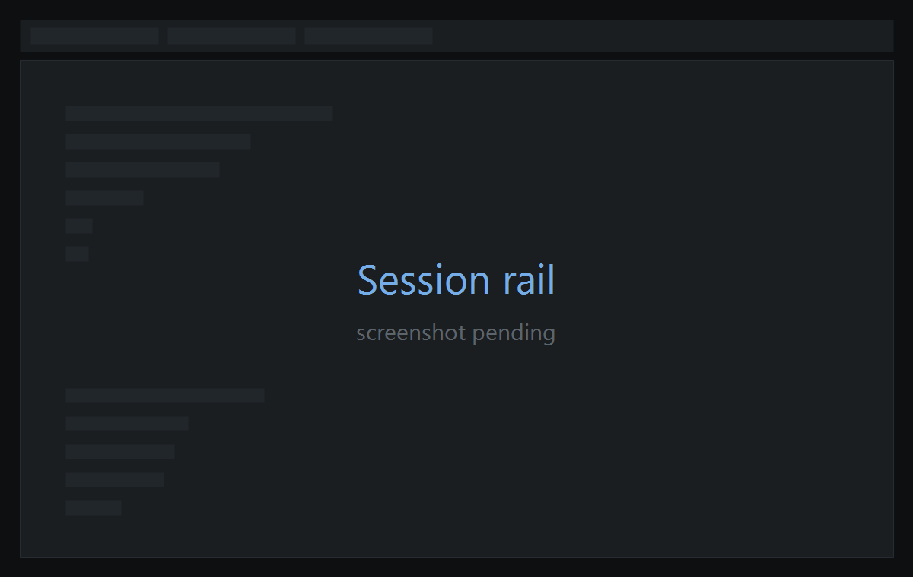
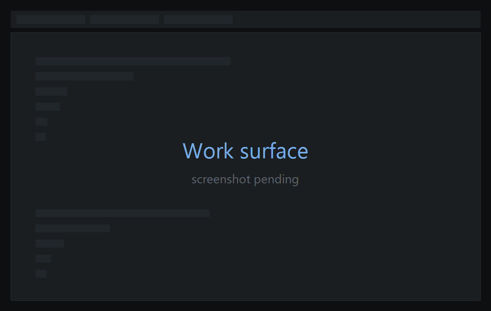
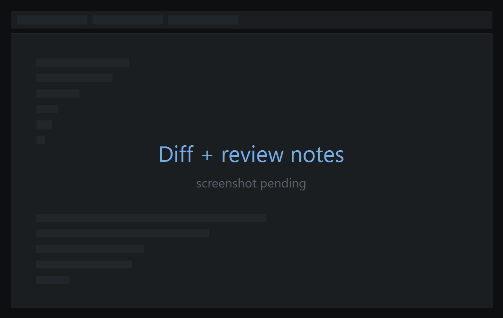
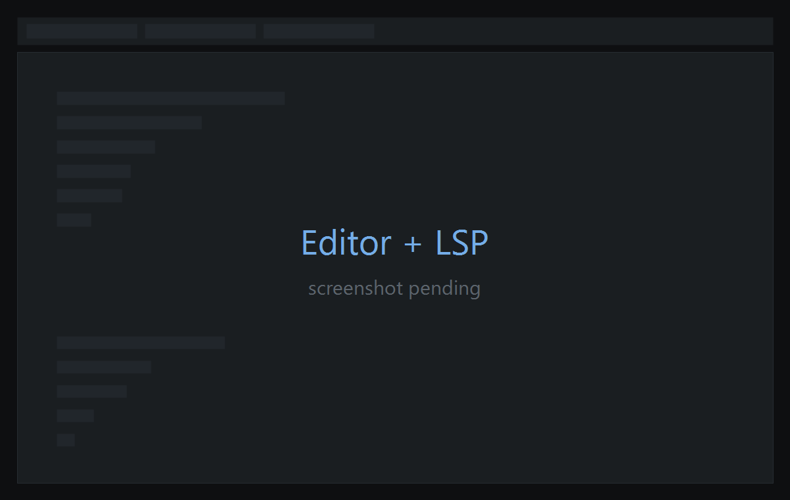
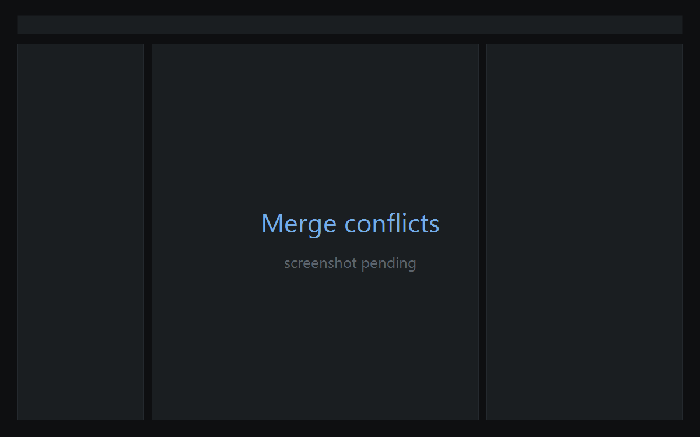
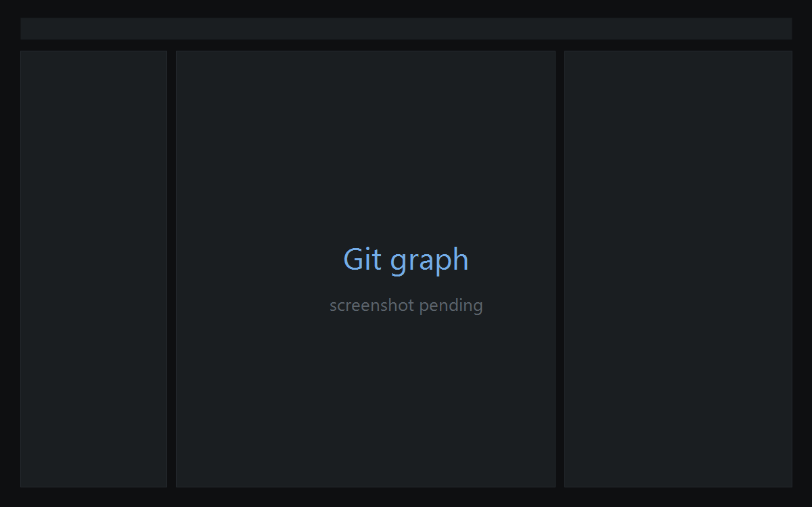

<h1 align="center">Jerry</h1>

<p align="center">
  <a href="https://github.com/ColinEspinas/jerry/releases/latest"></a>
  <a href="https://github.com/ColinEspinas/jerry/actions/workflows/ci.yml"></a>
  <a href="#license"></a>
  
  <a href="https://www.gpui.rs/"></a>
</p>

<p align="center">
  <strong>Run a team of AI coding agents without losing track of them.</strong><br/>
  Each one gets its own branch, its own terminal, and its own diff — all in one window.
</p>

<h3 align="center"><a href="../../releases/latest"><ins>Download Jerry</ins></a></h3>

<p align="center">
  
</p>

<p align="center">
  <sub><a href="#how-it-works">How it works</a> &nbsp;·&nbsp; <a href="#features">Features</a> &nbsp;·&nbsp; <a href="#supported-agents">Agents</a> &nbsp;·&nbsp; <a href="#install">Install</a> &nbsp;·&nbsp; <a href="CONTRIBUTING.md">Contributing</a></sub>
</p>

> [!NOTE]
> **Jerry is a working prototype, not a released product.** It does real work — real branches, real
> agent processes, real `git` — but expect rough edges. [What's rough](#whats-rough) is the honest
> list.

## How it works

**1. Open a repo.** Jerry finds every worktree it has and lists them in the rail, grouped by repo.

**2. Put an agent on one.** Right-click a worktree → **New agent here**, and your agent CLI starts up
in that checkout. Do it again on another worktree, and another — they're on separate branches and
separate files, so they can run at full speed without stepping on each other.

**3. Come back and review.** See what each one changed, comment on the lines you don't like, send the
notes back. Keep the work that landed; discard the rest.

Everything Jerry touches is ordinary `git`. Nothing reaches your main checkout until you say so, and
any branch it works with is inspectable — or undoable — from a plain terminal, with or without Jerry
running.

> Worktrees themselves are still created with `git worktree add`; Jerry picks them up from there. See
> [what's rough](#whats-rough).

---

## Features

<table>
<tr>
<td width="50%" valign="middle">

### Every agent gets its own branch

Start a session and it gets a real git worktree — its own checkout, its own branch. Agents work at
the same time without ever touching each other's files.

The rail keeps every session in view and sorts them by what needs you most: waiting on input, failed,
finished with changes to review, still running. That status is read from what the processes and the
repo are actually doing — not from what an agent claims about itself.

</td>
<td width="50%">
  
</td>
</tr>
<tr>
<td width="50%">
  
</td>
<td width="50%" valign="middle">

### The agent's real terminal

Not a transcript, not a log view — the actual CLI, behaving exactly as it does in your own terminal,
live interface and all. Anything you can do with the agent directly, you can do here.

Each worktree gets its own tabs, plus a plain shell for when you want to run something yourself.

</td>
</tr>
<tr>
<td width="50%" valign="middle">

### Comment on the diff, send it back

See exactly what an agent changed. Leave notes on the lines you want reworked, then send them all at
once — the agent gets them as one clear set of instructions instead of a dozen follow-up messages.

Notes stay pinned to the diff afterwards, so you can check the next attempt against what you actually
asked for.

</td>
<td width="50%">
  
</td>
</tr>
<tr>
<td width="50%">
  
</td>
<td width="50%" valign="middle">

### Fix it yourself when that's faster

Sometimes explaining the change takes longer than making it. A real editor is right there —
autocomplete, go-to-definition, inline errors — across Rust, TypeScript, JavaScript, Python, Go and
Vue.

No switching windows to fix a typo an agent left behind.

</td>
</tr>
<tr>
<td width="50%" valign="middle">

### Merge conflicts without the dread

When two sessions touch the same code, take either side hunk by hunk with a click — or edit the
conflict by hand when it needs real thought. Same editor either way.

</td>
<td width="50%">
  
</td>
</tr>
<tr>
<td width="50%">
  
</td>
<td width="50%" valign="middle">

### See the whole history

Every branch, commit and worktree in one picture, so you can tell at a glance what each agent has
actually done. Rebase interactively when you want to tidy up before merging.

</td>
</tr>
</table>

### Everything else

- **Undo a commit, undo a discard.** The command palette's History group walks back the worktree
  actions you'd otherwise have to redo by hand.
- **Who wrote this line?** When two agents share a worktree, Jerry can tell you which one is
  responsible for each line.
- **Every past run, kept.** Browse previous sessions by repo and worktree, read the full transcript,
  and pick a Claude Code conversation back up where it left off.
- **Know your limits.** How much of each provider's 5-hour and weekly allowance you've used, right
  next to the agent.
- **Search** across a worktree without leaving the window.
- **[Themes](docs/themes.md)** — six built in, or import one from VS Code. They're plain text files
  where every setting is optional, so a three-line file is a complete theme.
- **A sound when an agent finishes** — off until you turn it on.
- **Updates from inside the app.**

---

## Supported agents

| Agent | CLI | How Jerry tracks it |
| --- | --- | --- |
| **Claude Code** | `claude` | Directly — Claude Code reports its own state, so running/waiting/finished isn't guesswork. Past conversations can be resumed. |
| **Codex** | `codex` | Inferred from what its terminal is doing. |

Jerry runs the CLI **you** installed, in the session's worktree — your auth, your config, your
version. It doesn't bundle, wrap or proxy anything, and **Settings › Agents** tells you whether each
one is on your `PATH`.

**More are coming.** Any coding agent that runs in a terminal fits this model, and the goal is to
work with all of them. Today that's Claude Code and Codex; [Cursor](../../issues/353) is next. If
yours is missing, [open an issue](../../issues/new) — that's how it gets prioritised.

---

## Install

### Download

Grab a build from the [latest release](../../releases/latest):

| Platform | File |
| --- | --- |
| macOS (Apple Silicon) | `jerry-macos.tar.gz` |
| Linux (x86_64) | `jerry-linux.tar.gz` |
| Windows (x86_64) | `jerry-windows.zip` |

Every release ships all three, but they're not equally proven: macOS is the one run day to day, Linux
builds and runs against both Wayland and X11, and Windows is verified by CI.

### From source

```sh
git clone https://github.com/ColinEspinas/jerry
cd jerry
cargo run --release -p app [path-to-a-repo]
```

Uses the toolchain pinned in [`rust-toolchain.toml`](rust-toolchain.toml). Keep `--release` unless
you're actively recompiling — [`CLAUDE.md`](CLAUDE.md#commands) explains why a debug build isn't
worth measuring. Linux needs some system packages first; macOS needs Xcode Command Line Tools;
Windows needs nothing extra.

<details>
<summary><strong>System dependencies</strong></summary>

**Linux** needs real dev packages for Wayland/X11/Vulkan/fontconfig:

```sh
sudo apt-get install -y \
  build-essential clang cmake pkg-config \
  libfontconfig-dev \
  libvulkan1 mesa-vulkan-drivers \
  libwayland-dev libxkbcommon-dev libxkbcommon-x11-dev libx11-xcb-dev \
  libasound2-dev
```

(Trimmed from upstream Zed's own [`script/linux`](https://github.com/zed-industries/zed/blob/main/script/linux)
— see `.github/workflows/ci.yml`'s Linux job comments for what was dropped and why.) GPUI's Linux
backend compiles both the `wayland` and `x11` features and picks between them at runtime from
`$WAYLAND_DISPLAY`/`$DISPLAY`.

**macOS** needs Xcode Command Line Tools (`xcode-select -p` should print a path) and, if `cargo
build` fails with a Metal shader compilation error, `xcodebuild -downloadComponent MetalToolchain`.
No Homebrew packages — GPUI's macOS backend links Xcode's own system frameworks.

**Windows** needs no extra system packages beyond the Rust toolchain.

`gpui`/`gpui_platform` are git dependencies pinned by `rev =` to one exact
[`zed-industries/zed`](https://github.com/zed-industries/zed) commit; the revision itself lives in
the root [`Cargo.toml`](Cargo.toml), which is its only home. Cargo fetches it automatically.

If you're using [Claude Code](https://claude.com/claude-code), `/setup` runs all of these checks for
you.

</details>

---

## What Jerry won't do

Three rules this project holds itself to, because they're the difference between a tool you can trust
with your repo and one you can't.

- **No sandboxes, no copies.** Jerry uses real `git worktree`. Every branch it makes is inspectable,
  mergeable and undoable from any terminal, with or without Jerry installed.
- **No wrapping your agent.** Jerry spawns the CLI you already installed and stays out of the
  conversation — it never sits between you and the model, and never rewrites your prompts. The one
  addition is a settings file passed to Claude Code so it can report its own status back.
- **Nothing fake in the UI.** No button that looks wired up but isn't, no sample data standing in for
  a real source. Where something isn't built yet, it says so.

## What's rough

An honest read of a prototype, rather than a status badge:

- **You can't create a worktree from Jerry yet** — it attaches agents to worktrees that already
  exist, so `git worktree add` still happens in a terminal. Related:
  [#199](../../issues/199), [#198](../../issues/198).
- The Git changes pane doesn't always reflect real status ([#415](../../issues/415)).
- Interactive rebase has real bugs in its plan editing and its confirmations
  ([#343](../../issues/343), [#344](../../issues/344)).
- Review notes can't pick a target when a worktree has several agents ([#330](../../issues/330)).
- Killing a process tree doesn't work on macOS ([#422](../../issues/422)).
- The test suite isn't back in CI yet ([#426](../../issues/426)).

[All open issues →](../../issues)

## Built with

[GPUI](https://www.gpui.rs/) (Zed's UI framework) &nbsp;·&nbsp;
[`alacritty_terminal`](https://github.com/zed-industries/alacritty) + `portable-pty` for terminal and
PTY &nbsp;·&nbsp; [`gix`](https://crates.io/crates/gix) plus the real `git` CLI for version control
&nbsp;·&nbsp; [`lsp-types`](https://crates.io/crates/lsp-types) with a hand-written client
&nbsp;·&nbsp; `tree-sitter` for highlighting.

## Contributing

Issues and PRs are welcome. [`CONTRIBUTING.md`](CONTRIBUTING.md) covers the process and what has to
pass before a PR opens; [`CLAUDE.md`](CLAUDE.md) is the single source of truth for how the code
itself should look, for humans and agents alike.

The workspace is four crates — `wt-core` (git), `pty-core` (processes), `lsp-core` (language servers)
and `app` (the GPUI application, and the only crate allowed to depend on GPUI). The rules behind that
split, and the reasoning for each, are in [`docs/architecture/`](docs/architecture/overview.md); how
a change moves from issue to merged PR is in
[`docs/development-workflow.md`](docs/development-workflow.md).

## License

**[MIT](LICENSE-MIT) or [Apache-2.0](LICENSE-APACHE) — your choice.** Contributions are covered by
both unless you say otherwise.
